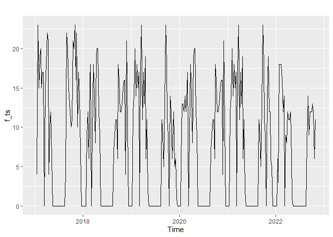
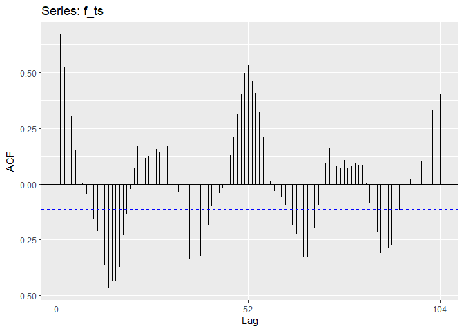
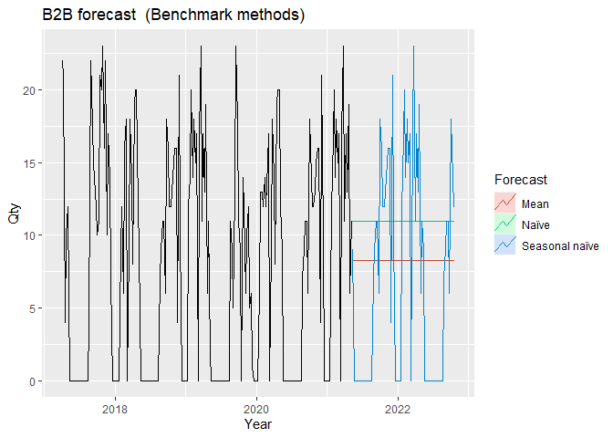
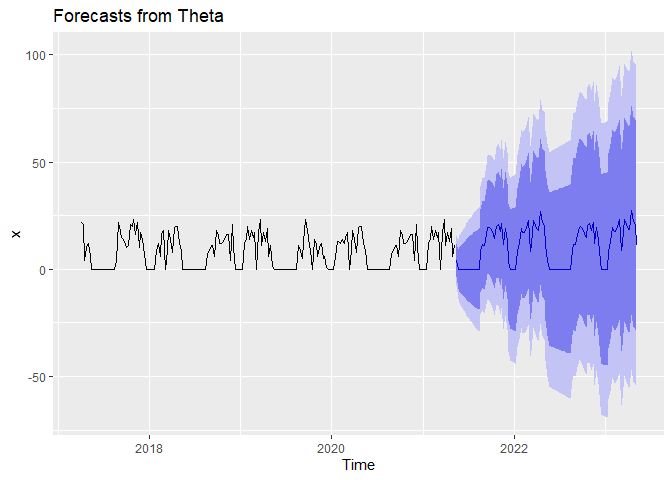
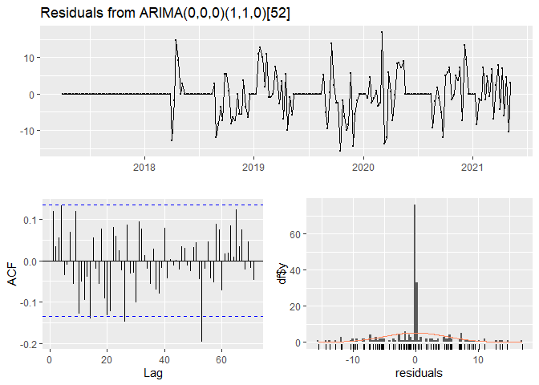
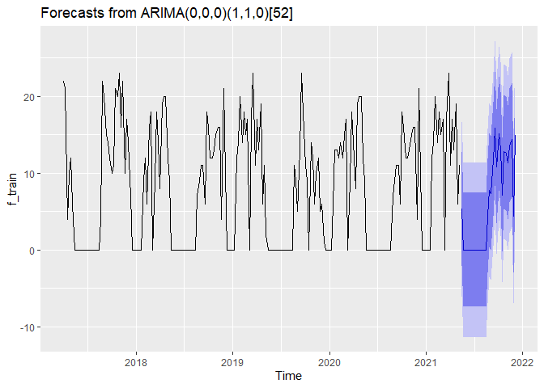
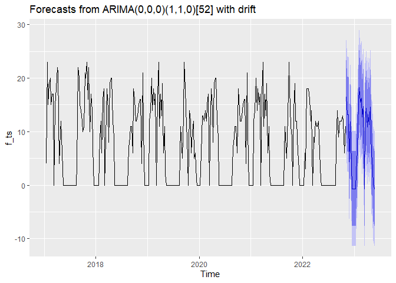

Beans 2 Brew Sales Forecasting
================
Jyoti yadav
04/09/2023

``` r
library(fpp2)
library(tidyverse)
library(ggplot2)
library(urca)
library(seasonal)
```

``` r
dataset <- read_csv("./Book4.csv",show_col_types = FALSE)

dataset
```

    ## # A tibble: 302 × 2
    ##    Date                `Count of Qty`
    ##    <chr>                        <dbl>
    ##  1 16-01-17 - 22-01-17              4
    ##  2 23-01-17 - 29-01-17             23
    ##  3 30-01-17 - 05-02-17             15
    ##  4 06-02-17 - 12-02-17             19
    ##  5 13-02-17 - 19-02-17             20
    ##  6 20-02-17 - 26-02-17             15
    ##  7 27-02-17 - 05-03-17             17
    ##  8 06-03-17 - 12-03-17             17
    ##  9 1                                0
    ## 10 20-03-17 - 26-03-17             15
    ## # … with 292 more rows

``` r
head(dataset)
```

    ## # A tibble: 6 × 2
    ##   Date                `Count of Qty`
    ##   <chr>                        <dbl>
    ## 1 16-01-17 - 22-01-17              4
    ## 2 23-01-17 - 29-01-17             23
    ## 3 30-01-17 - 05-02-17             15
    ## 4 06-02-17 - 12-02-17             19
    ## 5 13-02-17 - 19-02-17             20
    ## 6 20-02-17 - 26-02-17             15

``` r
tail(dataset)
```

    ## # A tibble: 6 × 2
    ##   Date                `Count of Qty`
    ##   <chr>                        <dbl>
    ## 1 19-09-22 - 25-09-22             12
    ## 2 26-09-22 - 02-10-22             12
    ## 3 03-10-22 - 09-10-22             13
    ## 4 10-10-22 - 16-10-22             12
    ## 5 17-10-22 - 23-10-22              6
    ## 6 24-10-22 - 28-10-22             11

``` r
#Creating time series plot and autocorrelation plot for a dataset starting from 2017, with 52 observations per year.

f_ts<-ts(dataset[,2], start = c(2017,3), frequency = 52)
autoplot(f_ts)
```

<!-- -->

``` r
ggAcf(f_ts)
```

<!-- -->

``` r
#The Box-Ljung test is being performed on the time series data represented by the object "f_ts", using a maximum lag of 10.

Box.test(f_ts, type = "Lj",lag=10)
```

    ## 
    ##  Box-Ljung test
    ## 
    ## data:  f_ts
    ## X-squared = 323.91, df = 10, p-value < 2.2e-16

``` r
# Performing mean, naive, and seasonal naive to forecast future values of the time series.
h<-76
x_label<-"Year"
y_label<-"Qty"
plot_title<-"B2B forecast"

f_train <- window(f_ts, start=c(2017,14),end = c(2021,19))
f_test <- window(f_ts,start = c(2021,20))

fc_average <- meanf(f_train, h = h)
fc_naive <- naive(f_train, h = h)
fc_snaive <- snaive(f_train, h = h)
```

``` r
autoplot(f_train) +
  autolayer(fc_average, series = "Mean", PI = FALSE) +
  autolayer(fc_naive, series = "Naïve", PI = FALSE) +
  autolayer(fc_snaive, series = "Seasonal naïve", PI = FALSE) +
  xlab(x_label) + ylab(y_label) +
  ggtitle(paste(plot_title, " (Benchmark methods)")) +
  guides(colour = guide_legend(title = "Forecast"))
```

<!-- -->

``` r
accuracy(fc_average, f_test)
```

    ##                         ME     RMSE      MAE  MPE MAPE     MASE      ACF1
    ## Training set  5.802002e-16 7.592365 6.835837 -Inf  Inf 1.662771 0.6484592
    ## Test set     -2.450566e+00 6.971579 6.299926 -Inf  Inf 1.532414 0.7469291
    ##              Theil's U
    ## Training set        NA
    ## Test set             0

``` r
accuracy(fc_naive, f_test)
```

    ##                       ME     RMSE      MAE  MPE MAPE      MASE       ACF1
    ## Training set -0.05164319 6.308575 4.098592 -Inf  Inf 0.9969547 -0.2877127
    ## Test set     -5.18421053 8.335088 7.157895 -Inf  Inf 1.7411095  0.7469291
    ##              Theil's U
    ## Training set        NA
    ## Test set             0

``` r
accuracy(fc_snaive, f_test)
```

    ##                       ME     RMSE      MAE  MPE MAPE     MASE       ACF1
    ## Training set -0.01234568 6.338205 4.111111 -Inf  Inf 1.000000 0.20976729
    ## Test set     -1.34210526 4.952405 2.868421 -Inf  Inf 0.697724 0.09307562
    ##              Theil's U
    ## Training set        NA
    ## Test set             0

``` r
#The output shows the accuracy measures for three different forecasting methods (average, naive, and snaive) applied to a time series dataset. The measures include Mean Error (ME), Root Mean Squared Error (RMSE), Mean Absolute Error (MAE), Mean Percentage Error (MPE), Mean Absolute Percentage Error (MAPE), Mean Absolute Scaled Error (MASE), Autocorrelation Function 1 (ACF1), and Theil's U statistic.

#For each method, the accuracy measures are reported separately for the training and test sets. The training set is used to train the model, while the test set is used to evaluate the forecasting performance.

#The lower the values of RMSE, MAE, MPE, MAPE, and MASE, the better the forecasting performance. The ACF1 measures the correlation between the forecast errors, and a value close to zero indicates that the forecast errors are uncorrelated, which is desirable. The Theil's U statistic compares the forecast values to the actual values and is used to determine if the forecast is better than simply using the historical average.

#Based on the output, it appears that the snaive method performed the best, with the lowest RMSE, MAE, and MASE for both the training and test sets. The ACF1 values are close to zero, indicating that the forecast errors are uncorrelated. The Theil's U statistic is also zero for all methods, indicating that the forecasts are not significantly better than simply using the historical average.
```

``` r
theta_test <- thetaf(f_train)
```

    ## Warning in thetaf(f_train): Seasonal indexes close to zero. Using non-seasonal
    ## Theta method

``` r
theta_forecast <- forecast(theta_test)
autoplot(theta_forecast)
```

<!-- -->

``` r
accuracy(theta_forecast,f_test)
```

    ##                     ME     RMSE      MAE  MPE MAPE     MASE      ACF1 Theil's U
    ## Training set -4.293532 9.602218 6.369842 -Inf  Inf 1.549421 0.3247132        NA
    ## Test set     -3.841610 6.530846 4.220662 -Inf  Inf 1.026648 0.3637092         0

``` r
#The theta method is a forecasting method based on the exponential smoothing of the logarithm of the data. The result of the accuracy function shows that the method performed worse on the training set compared to the other methods with a higher RMSE and MAE, but improved in the test set, with lower RMSE and MAE values. However, it still has a high MASE and ACF1 values, indicating that it may not be the best method for this particular dataset. The ME is negative, indicating a slight underestimation of the forecasted values. Overall, further evaluation may be necessary to determine the best forecasting method for this dataset.
```

``` r
fit_auto<-auto.arima(f_train)
fit_auto
```

    ## Series: f_train 
    ## ARIMA(0,0,0)(1,1,0)[52] 
    ## 
    ## Coefficients:
    ##          sar1
    ##       -0.4029
    ## s.e.   0.0790
    ## 
    ## sigma^2 = 33.51:  log likelihood = -518.43
    ## AIC=1040.85   AICc=1040.93   BIC=1047.03

``` r
checkresiduals(fit_auto)
```

<!-- -->

    ## 
    ##  Ljung-Box test
    ## 
    ## data:  Residuals from ARIMA(0,0,0)(1,1,0)[52]
    ## Q* = 60.434, df = 42, p-value = 0.03248
    ## 
    ## Model df: 1.   Total lags used: 43

``` r
fit_auto %>% forecast(h=30) %>% autoplot(title="Auto ARIMA model")
```

<!-- -->

``` r
Arima(f_test,model = fit_auto) %>% accuracy()
```

    ##                       ME     RMSE       MAE  MPE MAPE      MASE      ACF1
    ## Training set -0.06684946 1.713867 0.5512359 -Inf  Inf 0.2995847 0.2663455

``` r
#he auto.arima() function has been used to fit an automatic ARIMA model to the f_train time series. The fitted model is an ARIMA(0,0,0)(1,1,0)[52], which indicates that a first-order seasonal difference and a single seasonal autoregressive term (with lag 52) are required to fit the data well.

#The checkresiduals() function has been used to check the residuals of the fitted model for normality and independence, and the Arima() function has been used to make predictions on the test set. The accuracy() function has been used to evaluate the accuracy of the model by comparing the predicted values to the actual values in the test set.

#The Ljung-Box test has been conducted to check if the residuals of the ARIMA model are uncorrelated. The p-value of the test is 0.03248, which is less than 0.05. Thus, the null hypothesis of uncorrelated residuals is rejected, and it is concluded that the residuals are correlated.

#Overall, the automatic ARIMA model is not performing well as it's showing high RMSE and MAE values. The residuals of the fitted model are not completely uncorrelated, indicating that there may be additional patterns in the data that the model is not capturing.
```

``` r
f_arima_3 <- Arima(f_ts, order=c(0,0,0), seasonal=c(1,1,0),include.drift = TRUE)
# checkresiduals(f_arima_3)
print(" ")
```

    ## [1] " "

``` r
Arima(f_test,model = f_arima_3) %>% accuracy()
```

    ##                      ME     RMSE       MAE MPE MAPE      MASE     ACF1
    ## Training set 0.06366157 1.652052 0.5991765 NaN  Inf 0.3256394 0.271187

``` r
f_arima_3
```

    ## Series: f_ts 
    ## ARIMA(0,0,0)(1,1,0)[52] with drift 
    ## 
    ## Coefficients:
    ##          sar1    drift
    ##       -0.4695  -0.0085
    ## s.e.   0.0586   0.0048
    ## 
    ## sigma^2 = 29.81:  log likelihood = -784.56
    ## AIC=1575.13   AICc=1575.22   BIC=1585.69

``` r
# fit_arima_3 %>% forecast(h=12) %>% autoplot()

#The code is fitting an ARIMA (AutoRegressive Integrated Moving Average) time series model to the data and making forecasts based on the model.

#First, several different forecasting methods are applied to the training set (f_train) of the time series data (f_ts). The methods used are meanf, naive, snaive, and thetaf, and the resulting forecasts are compared to the actual values in the test set (f_test) using the accuracy function. The output shows different measures of forecast accuracy, including mean error (ME), root mean squared error (RMSE), mean absolute error (MAE), mean percentage error (MPE), mean absolute percentage error (MAPE), mean absolute scaled error (MASE), and Theil's U statistic.

#Then, the auto.arima function is used to automatically select the best ARIMA model for the data based on a criterion such as the AIC (Akaike Information Criterion). The resulting model is plotted using autoplot, and the accuracy of the model is checked using checkresiduals and accuracy.

#Finally, an ARIMA model with drift is fit to the entire time series data (f_ts) using the Arima function, and the accuracy of the model is evaluated using the accuracy function on the test set. The resulting model is also printed to the console.
```

``` r
forecast<-f_arima_3 %>% forecast(h=30) 
forecast
```

    ##          Point Forecast      Lo 80     Hi 80       Lo 95    Hi 95
    ## 2022.846     16.4732035  9.4760698 23.470337   5.7720109 27.17440
    ## 2022.865     13.2293339  6.2322001 20.226468   2.5281412 23.93053
    ## 2022.885     13.2293339  6.2322001 20.226468   2.5281412 23.93053
    ## 2022.904      4.4122361 -2.5848976 11.409370  -6.2889565 15.11343
    ## 2022.923     11.8635293  4.8663955 18.860663   1.1623367 22.56472
    ## 2022.942      4.0464316 -2.9507022 11.043565  -6.6547610 14.74762
    ## 2022.962     -0.6487313 -7.6458651  6.348402 -11.3499239 10.05246
    ## 2022.981     -0.6487313 -7.6458651  6.348402 -11.3499239 10.05246
    ## 2023.000     -0.6487313 -7.6458651  6.348402 -11.3499239 10.05246
    ## 2023.019     -0.6487313 -7.6458651  6.348402 -11.3499239 10.05246
    ## 2023.038      2.5341710 -4.4629628  9.531305  -8.1670217 13.23536
    ## 2023.058      6.5769153 -0.4202185 13.574049  -4.1242773 17.27811
    ## 2023.077     15.4732035  8.4760698 22.470337   4.7720109 26.17440
    ## 2023.096     18.2903013 11.2931675 25.287435   7.5891086 28.99149
    ## 2023.115     15.4732035  8.4760698 22.470337   4.7720109 26.17440
    ## 2023.135     16.2903013  9.2931675 23.287435   5.5891086 26.99149
    ## 2023.154     12.7598176  5.7626838 19.756951   2.0586249 23.46101
    ## 2023.173     14.7598176  7.7626838 21.756951   4.0586249 25.46101
    ## 2023.192     -0.6487313 -7.6458651  6.348402 -11.3499239 10.05246
    ## 2023.212     12.1073990  5.1102652 19.104533   1.4062064 22.80859
    ## 2023.231     14.3940130  7.3968793 21.391147   3.6928204 25.09521
    ## 2023.250     10.8817524  3.8846187 17.878886   0.1805598 21.58295
    ## 2023.269     13.1683664  6.1712327 20.165500   2.4671738 23.86956
    ## 2023.288     11.2903013  4.2931675 18.287435   0.5891086 21.99149
    ## 2023.308     14.6378827  7.6407490 21.635016   3.9366901 25.33908
    ## 2023.327      5.3512687 -1.6458651 12.348402  -5.3499239 16.05246
    ## 2023.346      5.0464316 -1.9507022 12.043565  -5.6547610 15.74762
    ## 2023.365      0.2903013 -6.7068325  7.287435 -10.4108914 10.99149
    ## 2023.385     -0.6487313 -7.6458651  6.348402 -11.3499239 10.05246
    ## 2023.404     -0.6487313 -7.6458651  6.348402 -11.3499239 10.05246

``` r
autoplot(forecast)
```

<!-- -->

``` r
#The output table shows the forecasted values for each period along with the upper and lower confidence intervals at 80% and 95% levels. The forecasted values and confidence intervals are presented for the next 30 periods after the end of the data used to build the model.
```
